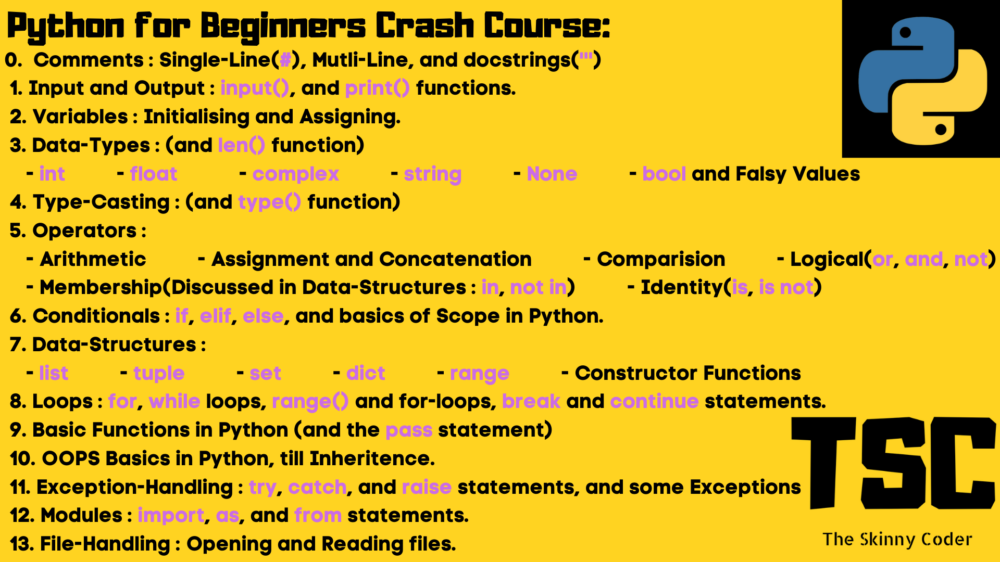

# GUIDE FOR THE TUTORIAL :

## **A) OVERVIEW :**


---

## **B) INSTALLING VSCODE :**

1. If you're on **Windows** (*eww*):
   1. Visit [VSCode](https://www.code.visualstudio.com).
   1. Download the Windows-64 'Stable' version.
   1. Follow the installation steps by running the downloaded file, and check the **ADD VSCode to PATH** option for sure.
  
1. If you're on **Linux** (the Gods):
   1. Install using [**snap**](https://snapcraft.io/code). Choose your distro type in the list to install **snap**. 
   1. **snap** is a new global package-manager common to all distros.
   ```bash
   $ # For example, on Debain-based systems :
   $ sudo apt update
   $ sudo apt install snapd
   $ sudo snap install code --classic
   ```

1. If you're on a **Mac** (Lucky you) :
   1. Visit [VSCode](https://www.code.visualstudio.com).
   1. Download the MacOS 'Stable' version.
   1. Follow the installation steps by running the downloaded file (OR)

   1. Install it using [**homebrew**](https://brew.sh/). It is a widely used package-manager on Mac.
  
   ```bash
   $ # Install Brew :
   $ /bin/bash -c "$(curl -fsSL https://raw.githubusercontent.com/Homebrew/install/master/install.sh)"
   ```
   ```bash
   $ # Install VSCode :
   $ brew update
   $ brew tap caskroom/cask
   $ brew cask search visual-studio-code
   $ brew cask install visual-studio-code 
   ```

---

## **C) INSTALLING PYTHON :**

1. If you're on **Windows** :
   1. Click this [link](https://www.python.org/ftp/python/3.8.3/python-3.8.3-amd64.exe) to download.
   1. Follow the installation steps by running the downloaded file, and check the **ADD Python to PATH** option for sure.
  
1. If you're on **Linux** :
   
   Install it using your distro's package manager.
   ```bash
   $ # For example, on Debain-based systems :
   $ sudo apt-get update
   $ sudo apt-get install python3
   ```

1. If you're on a **Mac** :
   
   Install it using **homebrew**.
   
   ```bash
   brew search python
   brew install python3
   ```

---

## **D) Get the boiler-plate and the completed code :**

- Make sure you've [git](https://git-scm.com/) installed on your system.
- The *__master__* branch will have initial code, and the **_completed_** branch will have the completed code.
- Clone the repo in your desired directory, to get the code :
   
```bash
# The dot is to clone the repo in the current directory.
git clone https://github.com/theskinnycoder/python_crash_course.git .
```
- Checkout to the *__master__* branch to get the initial code :

```bash
git checkout master
```

- Checkout to the **_completed_** branch to get the completed code :

```bash
git checkout completed
```

> Happy Coding!
